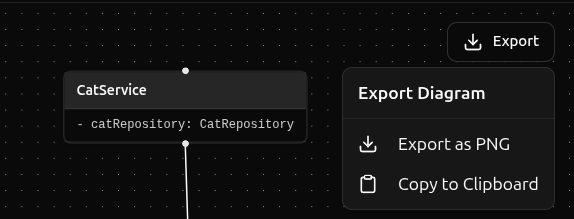

# 🎨 Code Graph - Interactive TypeScript UML Visualizer

> Transform your TypeScript code into beautiful, interactive UML diagrams in real-time. Design, visualize, and understand your code architecture instantly in your browser.

[](https://www.typescriptlang.org/)
[](https://reactjs.org/)
[](LICENSE)
[](https://www.docker.com/)
[](https://github.com/github/spec-kit)

> **Development Methodology**: This project is developed using [SpecKit](https://github.com/github/spec-kit) - a specification-driven development approach where features are fully specified, planned, and validated before implementation. All feature specifications can be found in the `specs/` directory.

## ✨ What is Code Graph?

**Code Graph** is a browser-based IDE that automatically generates UML class diagrams from your TypeScript code as you type. It's perfect for developers who want to visualize code structure, understand relationships between classes, and design better software architecture.

🚀 **[Try it now](https://code-graph.mkluszczynski.dev/)** - No installation required!

### Key Features

- 🎯 **Real-Time Visualization**: See UML diagrams update instantly as you write code
- 📝 **Full Code Editor**: Monaco Editor with TypeScript IntelliSense and syntax highlighting
- 🔍 **Dual View Modes**: Switch between focused file analysis and project-wide architecture view
- 🌳 **File Tree Management**: Create, rename, duplicate, and delete files with right-click context menu
- 📊 **Interactive Diagrams**: Click diagram nodes to navigate to code, zoom, pan, and export
- 💾 **Local Persistence**: All projects saved in browser (IndexedDB) - works completely offline
- 🎨 **Export Diagrams**: Save as PNG or copy directly to clipboard for easy sharing
- 🌓 **Dark Mode**: Beautiful light and dark themes for comfortable viewing
- ⚡ **Zero Setup**: No installation required - runs entirely in your browser

## 🎥 Quick Demo


**→ Instantly see UML diagrams showing:**
- Class structures with properties and methods
- Inheritance relationships with visual arrows
- Property visibility modifiers (public, private, protected)
- Interface implementations and associations

## 🚀 Getting Started

### Prerequisites

- **Node.js**: Version 20 LTS or higher
- **pnpm**: Version 8.0 or higher
- **Modern Browser**: Chrome 90+, Firefox 88+, Safari 14+, or Edge 90+

### Local Development Setup

1. **Clone the repository**
   ```bash
   git clone https://github.com/mkluszczynski/code-graph.git
   cd code-graph
   ```

2. **Install dependencies**
   ```bash
   cd frontend
   pnpm install
   ```

3. **Start the development server**
   ```bash
   pnpm dev
   ```

4. **Open your browser**
   
   Navigate to [http://localhost:5173](http://localhost:5173)

5. **Create your first UML diagram**
   - Click "Add File" → "New Class"
   - Write some TypeScript code in the editor
   - Watch the UML diagram appear in the right panel!

### Docker Deployment (Recommended for Production)

#### Using Docker Compose (Easiest)

1. **Start the application**
   ```bash
   docker-compose up
   ```

2. **Access the application**
   
   Open [http://localhost:5173](http://localhost:5173) in your browser

3. **Stop the application**
   ```bash
   docker-compose down
   ```

#### Using Docker Directly

1. **Pull the pre-built image**
   ```bash
   docker pull mkluszczynski/code-graph:latest
   ```

2. **Run the container**
   ```bash
   docker run -d -p 5173:80 --name code-graph mkluszczynski/code-graph:latest
   ```

3. **Access the application**
   
   Open [http://localhost:5173](http://localhost:5173) in your browser

4. **Stop the container**
   ```bash
   docker stop code-graph
   docker rm code-graph
   ```

#### Build Your Own Docker Image

```bash
cd frontend
docker build -t code-graph:local .
docker run -d -p 5173:80 code-graph:local
```

## 📖 Usage Guide

### Creating Your First Project

1. **Add a new file**: Click the "Add File" button in the left panel
2. **Choose file type**: Select "New Class" or "New Interface"
3. **Name your file**: Enter a name (e.g., "Person", "IRepository")
4. **Start coding**: Write TypeScript code in the Monaco editor
5. **View the diagram**: UML diagram updates automatically within 500ms

### File Operations

**Right-click** any file in the file tree to access:
- **Rename** (or press `F2`): Change file name
- **Duplicate** (or press `Ctrl+D`): Create a copy
- **Delete** (or press `Del`): Remove file with confirmation

### Understanding View Modes

#### File View (Default) - `Ctrl+Shift+F`
- **Purpose**: Focused analysis of a single file
- **Shows**: Current file's entities + imported entities with relationships
- **Layout**: Compact spacing for detailed viewing
- **Use case**: Understanding a specific class and its dependencies

#### Project View - `Ctrl+Shift+P`
- **Purpose**: Strategic overview of entire codebase
- **Shows**: All entities from all files
- **Layout**: Spacious layout for large-scale visualization
- **Use case**: Understanding overall architecture and system design

### Exporting Diagrams



1. Click the **"Export"** button in the diagram panel
2. Choose export option:
   - **Export as PNG**: Download high-quality image (auto-cropped, date-stamped)
   - **Copy to Clipboard**: Copy image for direct pasting into documents, chat apps, etc.

### Supported TypeScript Features

- ✅ Classes with properties and methods
- ✅ Interfaces with method signatures
- ✅ Inheritance (`extends`)
- ✅ Interface implementation (`implements`)
- ✅ Property visibility (`public`, `private`, `protected`)
- ✅ Associations (class properties of other class types)
- ✅ Generic types (`<T>`)
- ✅ Constructor parameters
- ✅ Method return types

### UML Diagram Elements

**Relationship Types:**
- **Inheritance**: Solid line with hollow triangle (→ Parent)
- **Implementation**: Dashed line with hollow triangle (┈┈▷ Interface)
- **Association**: Solid line with arrow (→ Associated Class)

**Visibility Modifiers:**
- `+` Public
- `-` Private
- `#` Protected

## 🏗️ Architecture

### Technology Stack

- **Frontend Framework**: React 19.2.0 with TypeScript 5.9.3
- **Code Editor**: Monaco Editor (same as VS Code)
- **Diagram Rendering**: React Flow + Dagre (automatic layout)
- **State Management**: Zustand
- **Local Storage**: IndexedDB via idb library
- **UI Components**: shadcn/ui + Radix UI
- **Styling**: Tailwind CSS
- **Build Tool**: Vite
- **Testing**: Vitest + Playwright + React Testing Library

### Project Structure

```
frontend/
├── src/
│   ├── components/          # UI components (AddButton, ExportButton, etc.)
│   ├── code-editor/         # Monaco editor integration
│   ├── diagram-visualization/ # UML diagram generation & rendering
│   ├── file-tree/           # File tree UI & operations
│   ├── project-management/  # IndexedDB persistence layer
│   ├── shared/              # Shared types, store, utilities
│   └── typescript-parser/   # TypeScript AST parsing
├── docs/                    # User guide and technical docs
├── tests/
│   ├── unit/               # Unit tests
│   ├── integration/        # Integration tests
│   └── e2e/                # End-to-end tests (Playwright)
├── Dockerfile              # Multi-stage Docker build
└── package.json
```

## 🧪 Development

### Running Tests

```bash
# Unit and integration tests
pnpm test

# End-to-end tests
pnpm test:e2e

# With coverage
pnpm test -- --coverage

# Watch mode
pnpm test -- --watch
```

### Code Quality

```bash
# Lint code
pnpm lint

# Type checking
pnpm build

# Run all checks
pnpm test && pnpm lint
```

### Building for Production

```bash
pnpm build
pnpm preview  # Preview production build locally
```

## 🐳 Docker Details

### Image Information

- **Image Name**: `mkluszczynski/code-graph:latest`
- **Base Image**: nginx:alpine (production)
- **Image Size**: ~50MB (production layer)
- **Port**: 80 (internal), maps to 5173 (external)

### Dockerfile Highlights

- **Multi-stage build**: Separate build and production stages
- **Optimized layers**: Minimal production image with nginx
- **Security**: Runs as non-root user
- **Performance**: Static file serving with nginx compression

### Environment Variables

```yaml
# docker-compose.yml
environment:
  - NODE_ENV=production
```

## 📊 Performance

- **Diagram Generation**: <200ms for 10 entities
- **Code Parsing**: <100ms per file
- **Export to PNG**: <2s for typical diagrams
- **Clipboard Copy**: <3s total workflow time
- **File Operations**: <100ms for rename/duplicate/delete
- **Container Startup**: <10s after image pull

## 🤝 Contributing

Contributions are welcome! This project follows a specification-driven development process.

### Development Workflow

1. **Fork the repository**
2. **Create a feature branch**: `git checkout -b feature/your-feature-name`
3. **Write tests first**: Follow TDD approach
4. **Implement the feature**: Make your changes
5. **Run tests**: Ensure all tests pass (`pnpm test && pnpm test:e2e`)
6. **Commit your changes**: Use clear, descriptive commit messages
7. **Push to your fork**: `git push origin feature/your-feature-name`
8. **Open a Pull Request**: Describe your changes and link any related issues

### Code Standards

- TypeScript with strict mode enabled
- Functions: Max 50 lines
- Files: Max 300 lines
- Test coverage: >80% for new code
- Follow existing code style (enforced by ESLint)

### Feature Specification Process

This project uses SpecKit for feature development:

1. **Specification**: Define requirements in `specs/` directory
2. **Planning**: Break down into implementable tasks
3. **Implementation**: TDD approach with contract tests
4. **Validation**: E2E tests verify user stories
5. **Documentation**: Update user guides and technical docs

See existing specs in `specs/` for examples.

## 📝 License

This project is licensed under the MIT License - see the [LICENSE](LICENSE) file for details.

## 🐛 Bug Reports & Feature Requests

Found a bug or have an idea? Please open an issue on GitHub:

- **Bug Report**: [Create an issue](https://github.com/mkluszczynski/code-graph/issues/new) with:
  - Browser version
  - Steps to reproduce
  - Expected vs actual behavior
  - Screenshots (if applicable)

- **Feature Request**: [Create an issue](https://github.com/mkluszczynski/code-graph/issues/new) with:
  - Use case description
  - Expected benefits
  - Possible implementation ideas

## 📧 Contact & Support

- **GitHub**: [@mkluszczynski](https://github.com/mkluszczynski)
- **Project Issues**: [GitHub Issues](https://github.com/mkluszczynski/code-graph/issues)
- **Documentation**: See `frontend/docs/` for detailed guides
- **Author**: Mateusz Kluszczyński

## 🗺️ Roadmap

### Completed Features ✅
- [x] Real-time UML diagram generation
- [x] File tree with context menu operations
- [x] Dual view modes (File View / Project View)
- [x] Cross-file import visualization
- [x] Diagram export (PNG + Clipboard)
- [x] Dark mode support
- [x] Docker deployment support

### Upcoming Features 🚀
- [ ] Multi-file selection and batch operations
- [ ] Diagram layout customization options
- [ ] Export to SVG with embedded styles
- [ ] GitHub repository import
- [ ] Collaborative editing (real-time sync)
- [ ] Plugin system for custom parsers
- [ ] VS Code extension
- [ ] Support for additional languages (JavaScript, Java, Python)

## 📈 Project Status

**Status**: Active Development 🟢

- **Latest Version**: 1.1.0
- **Last Updated**: November 2025
- **Test Coverage**: 98% (311/316 tests passing)
- **Production Ready**: Yes ✅

---

<div align="center">

**Built with ❤️ by [Mateusz Kluszczyński](https://github.com/mkluszczynski)**

[⭐ Star this repo](https://github.com/mkluszczynski/code-graph) | [🐛 Report Bug](https://github.com/mkluszczynski/code-graph/issues) | [💡 Request Feature](https://github.com/mkluszczynski/code-graph/issues)

</div>
